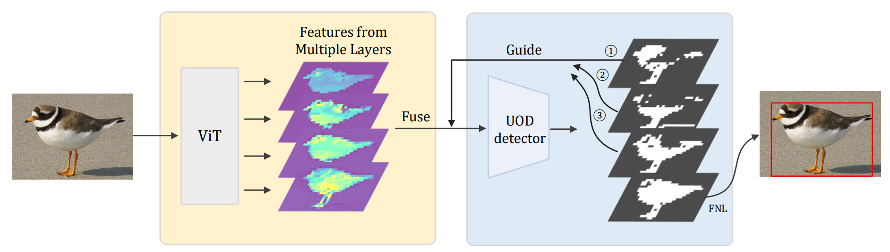

## Foreground Guidance and Multi-Layer Feature Fusion for Unsupervised Object Discovery with Transformers

This is the official implementation of the [Foreground Guidance and Multi-Layer Feature Fusion for Unsupervised Object Discovery with Transformers](http://arxiv.org/abs/2210.13053) (WACV2023)

<p align="center">
  
</p>


## Preparation

**Step 1.** Please install [PyTorch](https://pytorch.org/). 

**Step 2.** To install other dependencies, please launch the following command:

```
pip install -r requirements.txt
```


## Data Preparation

### PASCAL-VOC

Please download the PASCAL VOC07 and PASCAL VOC12 datasets ([link](http://host.robots.ox.ac.uk/pascal/VOC/)) and put the data in the folder `datasets`.

### COCO

Please download the [COCO dataset](https://cocodataset.org/#home) and put the data in `datasets/COCO`. We use COCO20k (a subset of COCO train2014) following previous works. 

The structure of the datasets folder will be like:

```
├── datasets
│  ├── VOCdevkit
│  │  ├── VOC2007
│  │  │  ├──ImageSets & Annotations & ...
│  │  ├── VOC2012
│  │  │  ├──ImageSets & Annotations & ...
|  ├── COCO
│  │  ├── annotations
│  │  ├── images
│  │  │  ├──train2014 & ...
```


## Singel Object Discovery

Following the steps to get the results presented in the paper.

### FORMULA-L

```bash
# for voc
python main_formula_LOST.py --dataset VOC07 --set trainval
python main_formula_LOST.py --dataset VOC12 --set trainval

# for coco
python main_formula_LOST.py --dataset COCO20k --set train
```

### FORMULA-TC

```bash
# for voc
python main_formula_TokenCut.py --dataset VOC07 --set trainval --arch vit_base
python main_formula_TokenCut.py --dataset VOC12 --set trainval --arch vit_base

# for coco
python main_formula_TokenCut.py --dataset COCO20k --set train --arch vit_base
```


## Results

The results of this repository:

|   Method   |   arch   | VOC07 | VOC12 | COCO_20k |
| :--------: | :------: | :---: | :---: | :------: |
| FORMULA-L  | ViT-S/16 | 64.28 | 67.65 |  54.04   |
| FORMULA-TC | ViT-B/16 | 69.13 | 73.08 |  59.57   |


## CAD and OD trainings

Please following [LOST](https://github.com/valeoai/LOST#installation-for-cad-and-od-trainings) to conduct the experiments of CAD and OD.


## License

The project is only free for academic research purposes, but needs authorization for commerce. For commerce permission, please contact [wyt@pku.edu.cn](mailto:wyt@pku.edu.cn).


## Citation

If you use our code/model/data, please cite our paper:

```
@InProceedings{Zhiwei_2023_WACV,
    author    = {Zhiwei Lin and Zengyu Yang and Yongtao Wang},
    title     = {Foreground Guidance and Multi-Layer Feature Fusion for Unsupervised Object Discovery with Transformers},
    booktitle = {Proceedings of the IEEE/CVF Winter Conference on Applications of Computer Vision (WACV)},
    year      = {2023}
}
```


## Acknowledgement

FORMULA is built on top of [LOST](https://github.com/valeoai/LOST), [DINO](https://github.com/facebookresearch/dino) and [TokenCut](https://github.com/YangtaoWANG95/TokenCut/). We sincerely thanks those authors for their great works and codes. 
